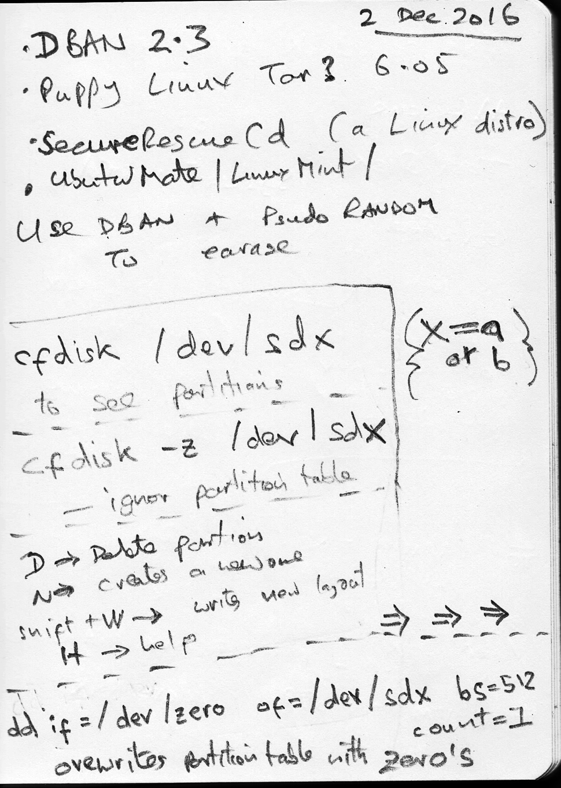
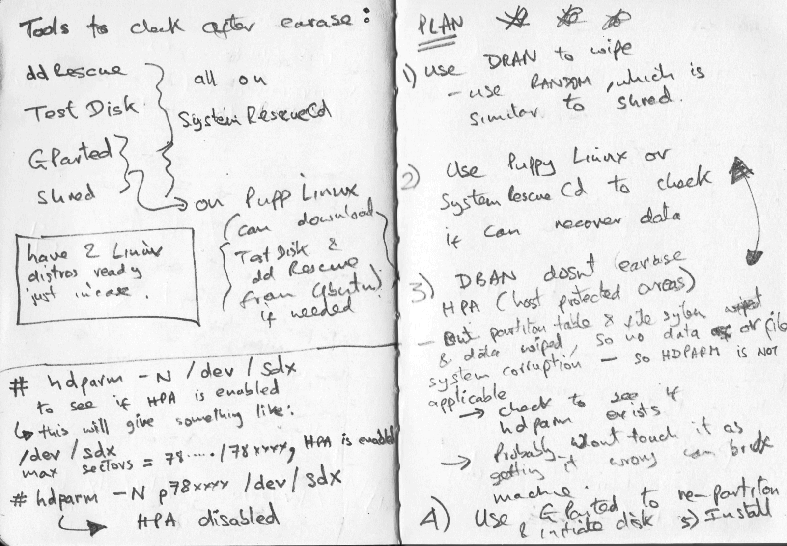
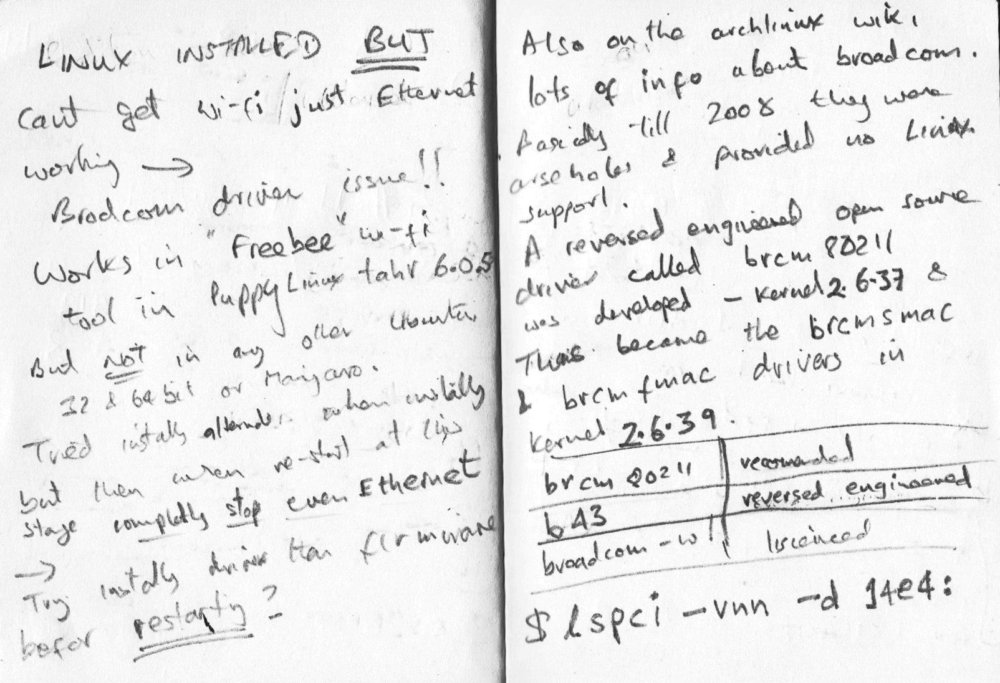
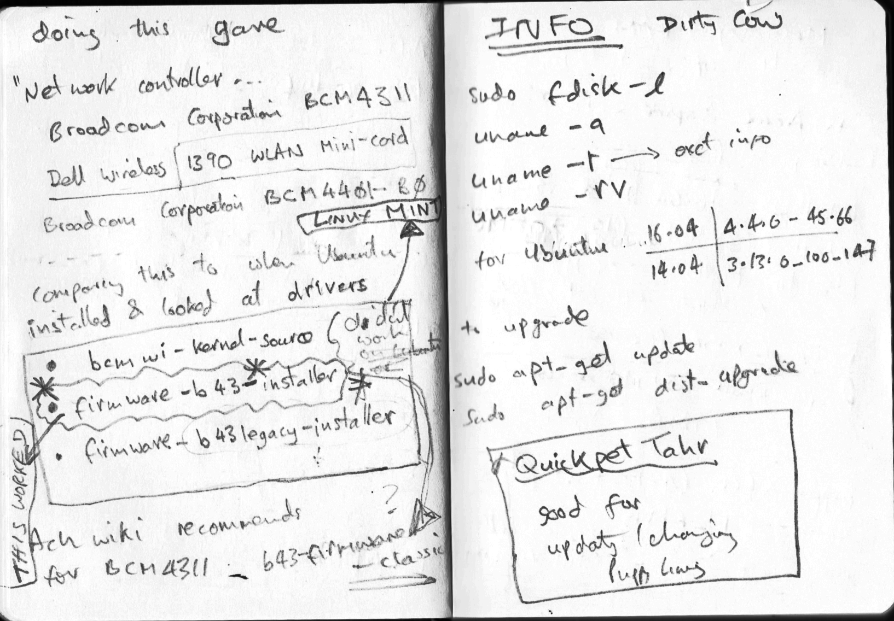

# wipingInstallingLinux

Handwritten notes wiping and installing linux from an old laptop

  * access all of the portfolio webpage's content just by scrolling.
  * click different buttons that will take me to the portfolio creator's different social media pages.
  * see thumbnail images of different projects the portfolio creator has built (if you haven't built any websites before, use placeholders).
  * navigate to different sections of the webpage by clicking buttons in the navigation.

  ### Initial thoughts on what tools to use to wipe the HD

  

  ### Plan 1: Use DBAN
  Important to get approach clear in mind before attempting erasing!

  

  ### Plan 2: DBAN didn't work a second approach required
  Used Gparted and a shred then dd to wipe

  

  ### Attempts to install Linux failed
  Discovered problems with both wi-Fi broadcom chipset and direct Eathernet
  This took several hours to figure out what was going on
  Puppy Linux became invaluable as a diagnostic tool in assuring me that Wi-Fi chipset did work, using Puppy Linux Frisbee.

  

  ### Installed correct firmware for BCM4311
Switched to Linux Mint with ethernet cable (now functioning) and installed the BCM4311 drivers
  

  ### Installed software packages
  Added offical ppas for LibreOffice, themes etc. Also GIMP plugins , added Blender and other tools.
  Created a simple text document user could read so that hopefully they could make use of the machine.
  I discovered the machine was for a 17 year old whos parents were not able to buy a computer .For him it was his 'new' computer for Christmas, so I put extra effort into polishing it up especially as I wasn't sure about his internet access.

  I also provided a 16GB USB stick in to give some external capacity to backup files

  I finished by physically cleaning the laptop including using acetone to remove Microsoft labels and dirt and such. I'm pleased to say the Laptop did look good and worked well, before passing it to the person who was going to deliver it to the young man :)
